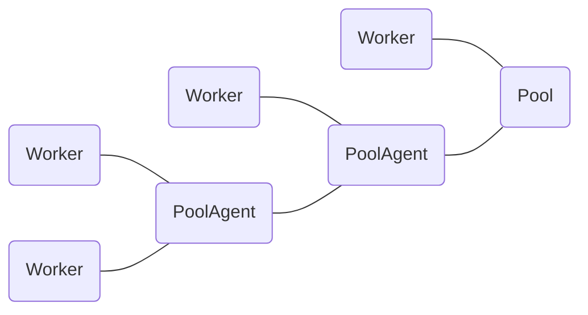

# zkwork_aleo_protocol
Zk.Work Aleo Protocol is a set of ore pool protocols designed by 6Block for Aleo mining. This library is an open source implementation of the ZK. Work Aleo Protocol.
## specs
### roles
1. zk.work aleo worker
2. zk.work aleo pool agent
3. zk.work pool server
### message
1. connect server
  
   **<<128,type,v_major,v_minor,v_patch,name>>**
2. submit block

   **<<129,id,address,nonce,pre_block_hash,proof>>**
3. disconnect server
   
   **<<130,id>>**
4. connect server response
   
   **<<0,is_accept,id>>**
5. notify job
   
   **<<1,share_difficulty,block_template>>**
1. pool shutdown

   **<<2>>**
### networking

## License

